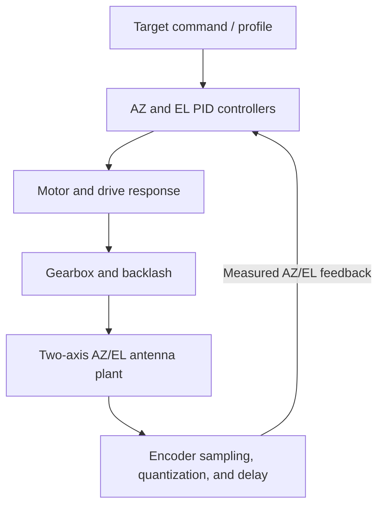
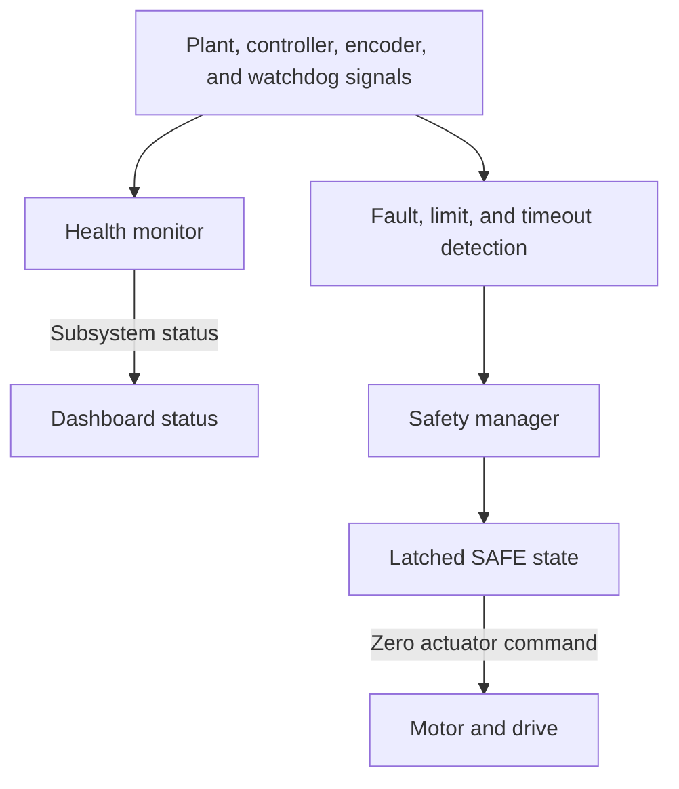

# SATCOM Antenna Pointing, Health Monitoring & Fault-Injection Simulator

An interactive browser-based electromechanical simulation of a two-axis SATCOM antenna pointing system, including closed-loop PID control, actuator and mechanical modelling, encoder feedback, fault injection, health monitoring, and safety-state management.

> This project is a simplified model for engineering education and portfolio demonstration. This is not a certified SATCOM control system and must not be used to control real equipment.

## Live Demo

<https://saadwajih99.github.io/satcom-antenna-pointing-simulator/>

## Features

- Two-axis AZ/EL target tracking with step, ramp, sinusoidal, and synthetic satellite-pass references
- Closed-loop PID control with filtered derivative, output limits, and conditional anti-windup
- Encoder feedback with sampling, quantization, noise, zero offset, dropout, and communication delay
- Motor/actuator response, torque and speed limits, thermal derating, and degradation
- Gearbox ratio, efficiency, friction, and backlash behavior
- External, wind, and seeded random disturbance models
- Fault injection and preset multi-condition scenarios
- Subsystem health monitoring and rolling tracking-quality criteria
- Independent safety manager, travel limits, watchdog, emergency stop, and re-arm
- Real-time AZ/EL telemetry and Canvas plots
- Rise time, overshoot, settling time, steady-state error, RMS error, maximum error, and maximum effort metrics
- Event log and guided demonstration mode
- Live engineering parameter controls

## Architecture

The target generator and plant run in a deterministic 50 Hz simulation loop. The user interface renders independently of the simulation step.



Monitoring and protective actions are modeled separately from the motion path:



The implementation is intentionally dependency-free and keeps the physical/control model in one cohesive simulator module rather than splitting it into placeholder subsystem files.

| Path | Responsibility |
| --- | --- |
| `index.html` | Dashboard structure and inline SVG antenna view |
| `src/main.js` | Fixed-step scheduler and render loop |
| `src/simulation/simulator.js` | Target profiles, PID, two-axis plant, encoder, motor/gearbox, faults, health, safety, and metrics |
| `src/ui/antennaView.js` | AZ compass, elevation side view, and responsive SVG layout |
| `src/ui/charts.js` | Bounded telemetry history and Canvas plots |
| `src/ui/dashboard.js` | Controls, telemetry, event log, health, safety, and metrics |
| `src/ui/scenarios.js` | Scenario presets and guided demonstration |
| `src/styles.css` | Responsive visual styling |
| `tests/simulator.test.js` | Deterministic Node.js model tests |
| `docs/` | Architecture, engineering-model, and testing notes |

## Engineering Model

The model uses a fixed `0.02 s` (50 Hz) simulation step. AZ and EL each use a PID controller, sampled encoder feedback, a motor/gearbox response, inertia, friction, travel limits, and external disturbances. A seeded pseudo-random generator makes noise and random disturbances repeatable. The satellite-pass profile is a synthetic reference; it is not an orbit or ephemeris calculation.

See [docs/model-reference.md](docs/model-reference.md) for defaults, model behavior, health criteria, performance definitions, and limitations. See [docs/architecture.md](docs/architecture.md) for the signal-flow diagram.

## Fault Scenarios

- **Encoder dropout:** feedback becomes invalid and stale; persistent loss can trip SAFE.
- **Motor saturation:** limits available controller output to model reduced-drive capacity.
- **Watchdog stall:** stops the simulated heartbeat and trips after the configured timeout.
- **Excessive backlash:** increases reversal lost motion in the gearbox.
- **Increased friction:** raises the mechanical load opposing movement.
- **Motor degradation:** reduces available torque.
- **Wind and communication delay:** challenge tracking and feedback response.
- **Multi-fault:** combines encoder bias/noise, backlash, torque loss, wind, and delay.
- **Poor PID tuning:** changes controller gains and disables anti-windup for comparison.

Each preset and individual injection control changes the same live model used by the dashboard; scenarios do not swap in a separate demonstration implementation.

## Safety

- **Encoder failure:** invalid feedback is shown as stale; a persistent dropout latches SAFE.
- **Watchdog timeout:** a stalled heartbeat latches SAFE after the configured timeout.
- **Travel limits:** prevent motion farther out of a configured hard stop and report WARNING; motion back into range remains possible.
- **Motor saturation / overload:** output and available torque are limited; a thermal proxy can derate torque and trips SAFE at its model threshold.
- **Emergency stop:** latches SAFE and commands zero actuator output until the critical condition is cleared and the system is re-armed.

These are software-model behaviors for demonstration, not certified protections or substitutes for independent hardware interlocks. Thresholds are illustrative and not suitable for setting real alarms.

## Performance Metrics

- **Rise time:** 10% to 90% response progress; the slower active axis is reported.
- **Overshoot:** maximum progress beyond the final step target.
- **Settling time:** both axes remain inside their model tolerance for at least one second.
- **Steady-state error:** mean combined AZ/EL error over the most recent second.
- **RMS error and maximum error:** combined tracking error since the performance window began.
- **Maximum effort:** peak absolute normalized PID output since the performance window began.

Step-response metrics are only reported for step references. The exact formulas and reset behavior are documented in [docs/model-reference.md](docs/model-reference.md).

## Run Locally

Requirements: a modern browser and Python 3 (for the static server); Node.js 18 or newer is needed only to run tests. There are no runtime or development package dependencies to install.

```bash
git clone https://github.com/SaadWajih99/satcom-antenna-pointing-simulator.git
cd satcom-antenna-pointing-simulator
python -m http.server 8000
```

Open <http://localhost:8000>. Use a local server because browsers restrict JavaScript ES modules opened directly from `file://` URLs.

Run the simulator tests from the repository root:

```bash
npm test
```

The equivalent command is `node --test tests/simulator.test.js`.

## Deployment

This is a plain static HTML/CSS/JavaScript project. GitHub Pages publishes the repository root from `main` through its Pages-managed build-and-deployment workflow. There is no Vite/React build, `dist/` directory, external library, backend, or checked-in custom deployment workflow. Relative stylesheet and module paths work at the project Pages base path.

To update the live site after cloning:

```bash
git pull --ff-only origin main
npm test
# edit the source and verify it locally
git add README.md docs index.html src tests package.json .gitignore
git commit -m "Describe the change"
git push origin main
```

Pushing to `main` starts the GitHub Pages build/deploy workflow. Check the repository's **Actions** tab for a successful `pages build and deployment` run, then open the Live Demo URL above. Do not commit a separate compiled copy: the tracked root source is what Pages deploys.

## Testing

The automated suite covers nominal motion, target profiles, PID limits and anti-windup, encoder behavior, backlash, torque degradation, hard stops, watchdog and thermal trips, emergency stop/re-arm, deterministic repeatability, reset behavior, and health/performance recovery. See [docs/testing.md](docs/testing.md) for a repeatable browser smoke-test checklist.

## License

MIT. See [LICENSE](LICENSE).
