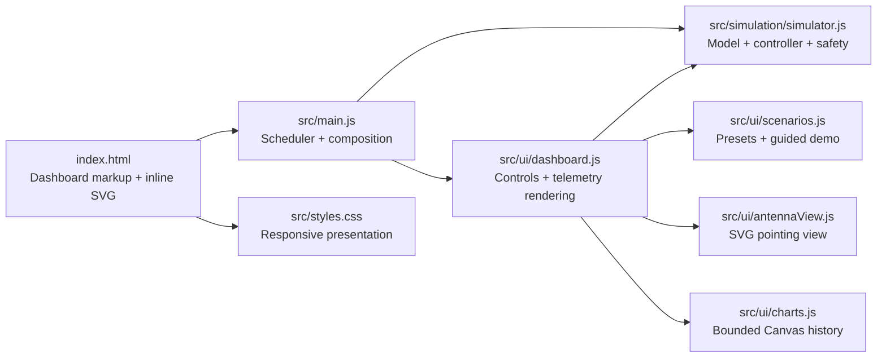
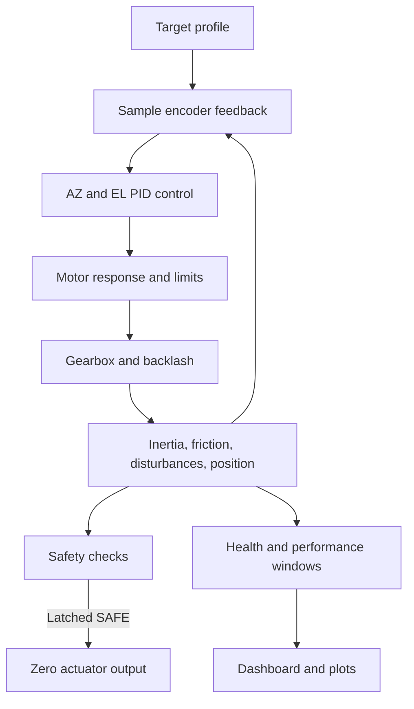

# Architecture

This is a dependency-free static web application. `index.html` is both the application shell and the markup source for the inline SVG antenna view. The browser loads native JavaScript ES modules directly; there is no compile or bundling stage.

## Runtime Structure

`main.js` creates one simulator, chart-history object, and dashboard. The UI calls the simulator's public functions in response to user input and reads its state during rendering. The model has no DOM dependency, so tests can import and advance it directly in Node.js.

## Simulation Cycle

The application advances the model using a `0.02 s` fixed step (50 Hz). `main.js` accumulates elapsed frame time, caps work after a slow frame, and renders at most every 100 ms. The model itself subdivides larger requested test steps to no more than `0.02 s`. Rendering is independent from simulation time; pausing stops model updates while leaving the dashboard available.

## Module Responsibilities

| Module | Responsibility |
| --- | --- |
| `index.html` | Application structure, controls, and inline antenna SVG. |
| `src/main.js` | Module composition, fixed-step scheduling, catch-up limit, and render cadence. |
| `src/simulation/simulator.js` | Seeded state, AZ/EL targets, encoder, PID, motor and gearbox, plant dynamics, fault behavior, health, safety, and performance metrics. |
| `src/ui/dashboard.js` | DOM event wiring, model configuration controls, status/telemetry rendering, event log, and dashboard updates. |
| `src/ui/scenarios.js` | Reproducible model presets and the guided demonstration sequence. |
| `src/ui/antennaView.js` | Maps simulated azimuth/elevation into the inline SVG and handles resize. |
| `src/ui/charts.js` | Stores up to 600 recent samples and draws position, error, control, and encoder plots on Canvas. |
| `src/styles.css` | Responsive layout, typography, and visual states. |
| `tests/simulator.test.js` | Deterministic tests of the model API and safety/recovery behavior. |

The model is deliberately kept cohesive in one simulator module: the simulated subsystems share state and a fixed integration step. Splitting them into placeholder files would not create meaningful independent boundaries.

## Static Hosting And Asset Paths

The application uses relative paths so it works from both a local static server and the repository's project Pages path. JavaScript and CSS imports currently include the `phase14-1` query value for cache differentiation. When shipping changes that could be hidden by stale cached modules, update that value consistently in the HTML and the versioned imports under `src/`.

The root `index.html` is the deployable application. Do not create a separate `dist/` copy or add a build tool unless the hosting architecture changes. See the [README deployment instructions](../README.md#deployment) and [model reference](model-reference.md) for hosting and model behavior.
